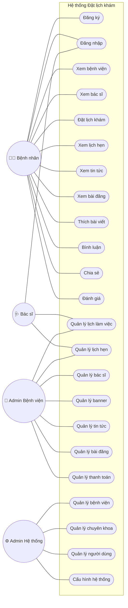
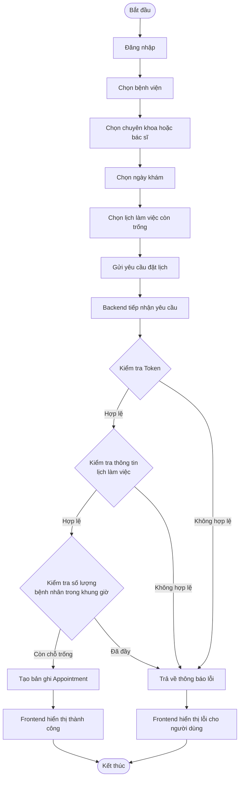
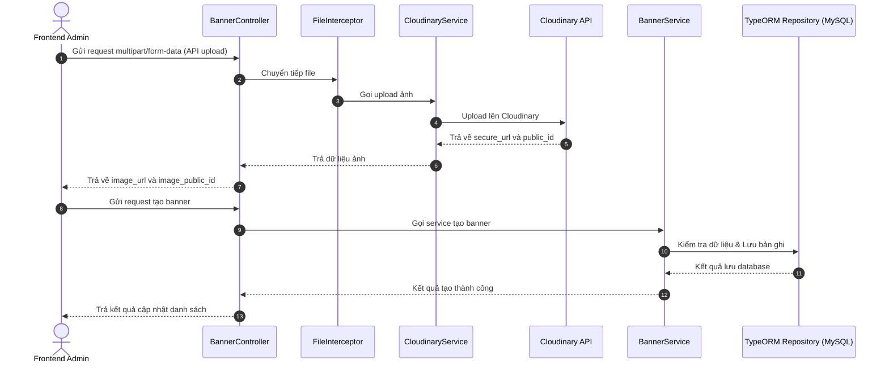
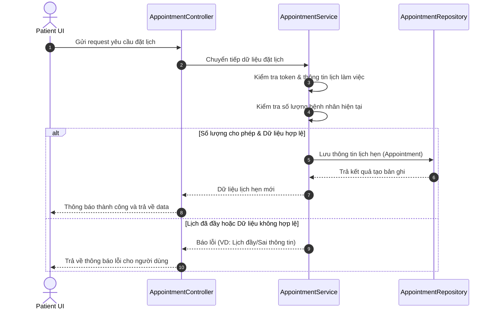

# Biểu đồ thiết kế hệ thống

Dựa trên thông tin phân tích yêu cầu từ dự án (gồm 2 phần `Schedule-a-medical-examination` và `web-admin`), dưới đây là các biểu đồ Use Case, Activity và Sequence được mô phỏng bằng ngôn ngữ Mermaid để tích hợp thẳng vào file Markdown.

## 3.5. Biểu đồ Use Case (Use Case Diagram)

Biểu đồ dưới đây thể hiện các chức năng của hệ thống đối với từng nhóm đối tượng người dùng (Bệnh nhân, Bác sĩ, Admin Bệnh viện, Admin Hệ thống).

## 3.6. Biểu đồ Activity (Activity Diagram)

Mô tả luồng xử lý nghiệp vụ **Đặt lịch khám bệnh**.

## 3.7. Biểu đồ Sequence (Sequence Diagram)

### 3.7.1. Chức năng Upload Banner

Mô tả thứ tự tương tác khi Frontend Admin upload banner lên hệ thống (qua Cloudinary) và lưu vào cơ sở dữ liệu.

### 3.7.2. Chức năng Đặt lịch khám

Mô tả trình tự tương tác giữa bệnh nhân, API và hệ thống cơ sở dữ liệu khi thực hiện đặt lịch hẹn.

