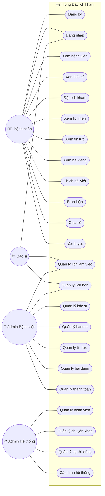
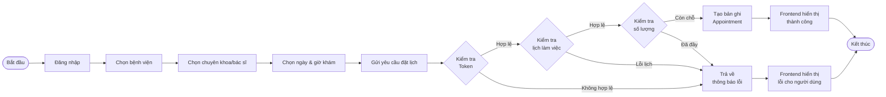
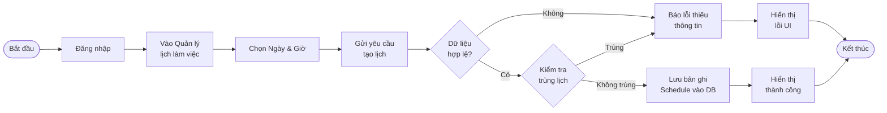
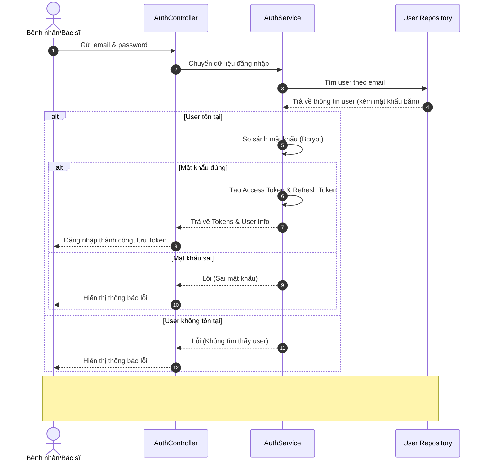
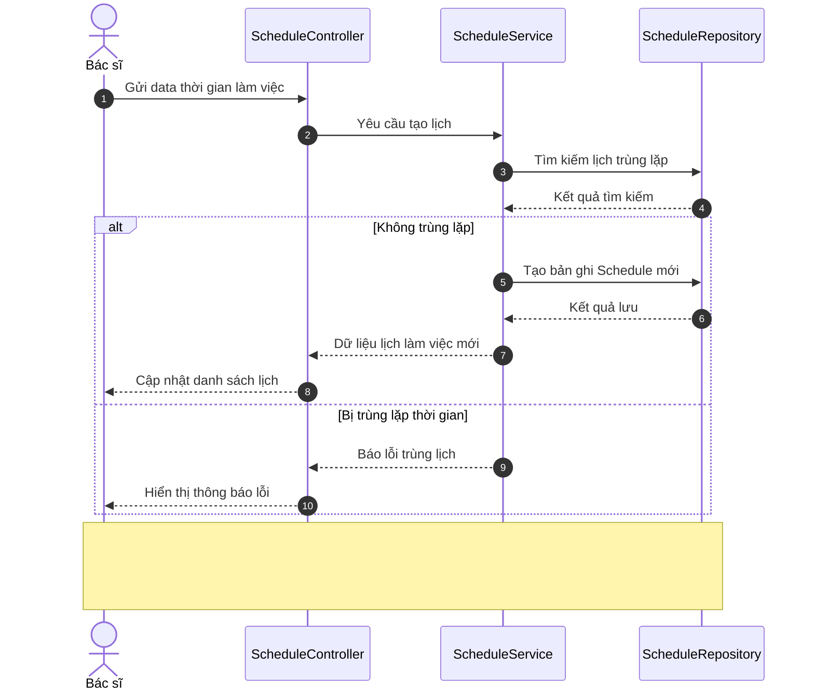
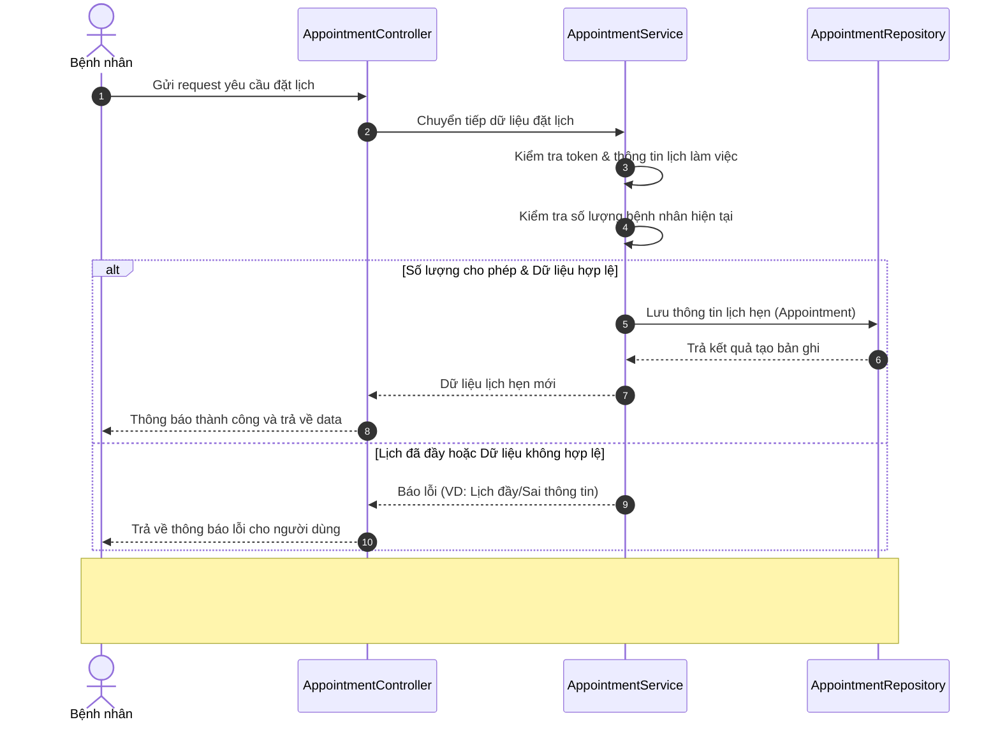
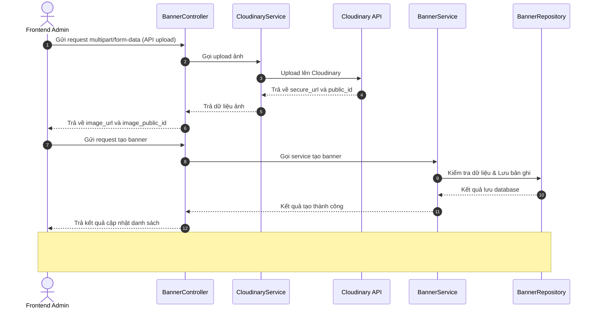

# Biểu đồ thiết kế hệ thống

Dựa trên thông tin phân tích yêu cầu từ dự án, dưới đây là các biểu đồ Use Case, Activity và Sequence đã được mở rộng và tối ưu (dàn ngang) để hỗ trợ việc hiển thị và chụp ảnh rõ nét hơn.

## 3.5. Biểu đồ Use Case (Use Case Diagram)

## 3.6. Biểu đồ Activity (Activity Diagram)

*Các biểu đồ đã được đổi hướng sang Left-to-Right (trải dài theo bề ngang) để tối ưu không gian hiển thị và chụp ảnh.*

### 3.6.1. Luồng đặt lịch khám bệnh (Bệnh nhân)

### 3.6.2. Luồng tạo lịch làm việc (Bác sĩ/Admin)

## 3.7. Biểu đồ Sequence (Sequence Diagram)

*(Tôi đã thêm các không gian đệm ở cuối biểu đồ để cụm nút công cụ zoom không che mất nội dung)*

### 3.7.1. Chức năng Đăng nhập (Authentication)

### 3.7.2. Chức năng Quản lý lịch làm việc (Tạo ca làm việc)

### 3.7.3. Chức năng Đặt lịch khám

### 3.7.4. Chức năng Upload Banner

